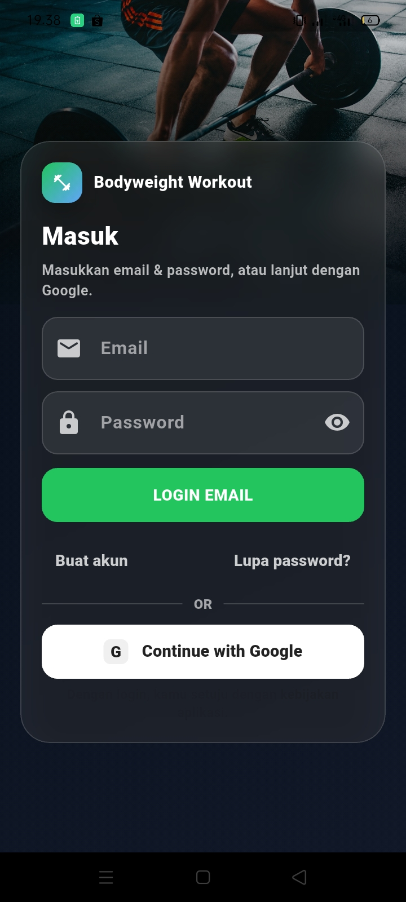
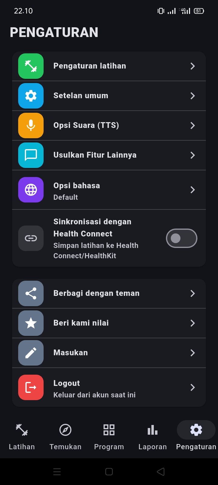

# 🏋️‍♂️ Bodyweight Workout (Flutter)

[](https://flutter.dev)
[](https://dart.dev)
[](https://firebase.google.com)


## 📖 Deskripsi
**Bodyweight Workout** adalah aplikasi mobile berbasis **Flutter** yang dirancang untuk membantu pengguna melakukan latihan fisik mandiri di rumah tanpa perlu alat tambahan. Project ini mengedepankan pengalaman pengguna yang intuitif dengan sinkronisasi data real-time menggunakan **Firebase**.

> **🎯 Konteks Project:** Dikembangkan sebagai project utama mata kuliah *Mobile Application Development* (Semester 5) oleh **Kelompok 6**.

---

## 👥 Tim Pengembang (Kelompok 6)
Berikut adalah anggota tim di balik pengembangan aplikasi ini:
* **Shofi**: Project Manager
* **Jefry**: Frontend Developer
* **Mulana**: Backend Developer
* **Muhaemin**: Database Engineer
* **Fujiyanti & Haddad**: Tester & Dokumentasi

---

## 📸 Antarmuka Aplikasi (Preview)

| Halaman Login | Daftar Latihan | Program Terstruktur |
| :---: | :---: | :---: |
|  |  |  |

| Eksplorasi & Target | Laporan Progres | Menu Pengaturan |
| :---: | :---: | :---: |
|  |  |  |

---

## ✨ Fitur Unggulan
- **🏋️ Variasi Latihan:** Rencana latihan (7–21 hari) mulai dari pemula hingga lanjutan.
- **📊 Tracker Progres:** Monitoring riwayat latihan, estimasi kalori, dan berat badan.
- **🔥 Firebase Integration:** Penyimpanan data dan sinkronisasi yang aman.
- **🌙 Modern UI:** Full support **Dark Mode** dengan Material Design 3.
- **🔊 Accessibility:** Integrasi panduan suara **Text-to-Speech (TTS)**.

---

## 🛠️ Detail Teknis & Instalasi

### Teknologi & Database
* **Frontend:** Flutter & Dart
* **Database:** Firebase (Auth, Firestore/Realtime Database)
* **UI Standard:** Material Design 3

### Langkah Instalasi
```bash
# Clone repository
git clone [https://github.com/yantifuji85-crypto/app_Latihan_Rumahan-Web-mobile.git](https://github.com/yantifuji85-crypto/app_Latihan_Rumahan-Web-mobile.git)

# Masuk ke direktori project
cd app_Latihan_Rumahan-Web-mobile

# Install dependencies
flutter pub get

# Jalankan aplikasi
flutter run