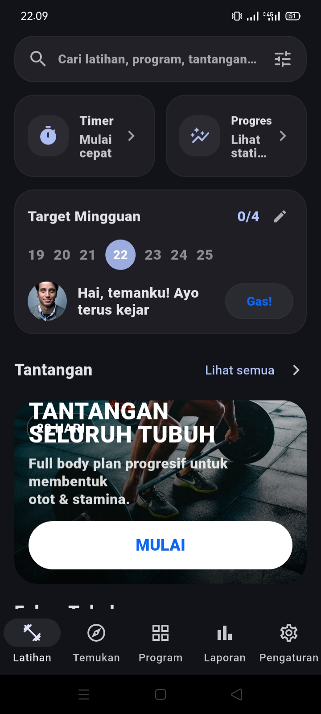
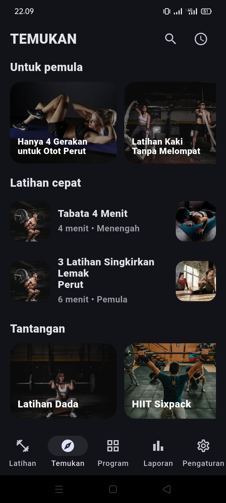
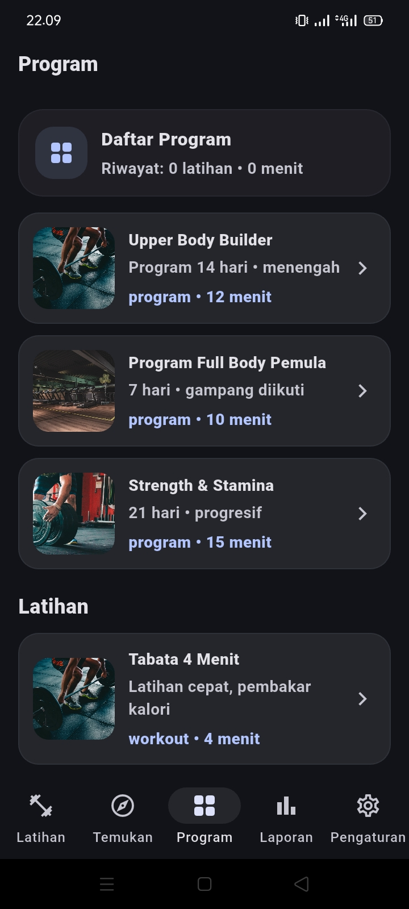
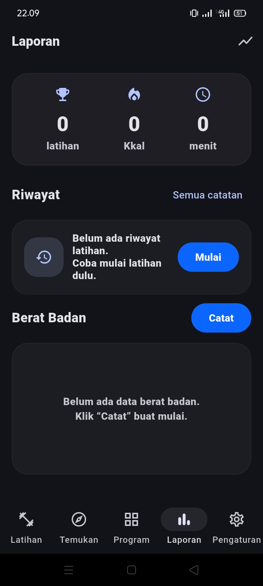

# 🏋️‍♂️ App Latihan Rumahan (Flutter)


---

## 📖 Deskripsi

**App Latihan Rumahan** adalah aplikasi mobile berbasis **Flutter** yang dirancang untuk membantu pengguna melakukan latihan olahraga secara mandiri di rumah.  
Aplikasi ini menyediakan berbagai **program latihan**, **latihan cepat**, **tantangan**, serta **laporan progres latihan** dengan tampilan modern (dark mode) dan mudah digunakan.

Aplikasi ini dikembangkan sebagai **tugas perkuliahan** sekaligus media pembelajaran pengembangan aplikasi mobile menggunakan Flutter.

---

## 🎯 Tujuan Pengembangan

- Mengimplementasikan konsep **Mobile Application Development**
- Menerapkan **UI/UX modern** pada aplikasi Flutter
- Membuat aplikasi kebugaran yang **user-friendly**
- Menyediakan fitur latihan tanpa alat dan mudah diikuti

---

## ✨ Fitur Utama

### 🏋️ Latihan
- Daftar latihan berdasarkan kategori
- Latihan untuk pemula hingga menengah
- Latihan cepat (contoh: Tabata 4 Menit)

### 🔍 Temukan
- Rekomendasi latihan untuk pemula
- Tantangan seluruh tubuh
- Pencarian latihan, program, dan tantangan
- Target mingguan latihan

### 📋 Program
- Program latihan terstruktur (7–21 hari)
- Program Full Body, Upper Body, dan Strength & Stamina
- Durasi latihan yang jelas dan progresif

### 📊 Laporan
- Riwayat latihan
- Total latihan, durasi, dan estimasi kalori
- Pencatatan berat badan

### ⚙️ Pengaturan
- Pengaturan latihan
- Setelan umum aplikasi
- Opsi suara (TTS)
- Sinkronisasi dengan Health Connect
- Bahasa
- Berbagi aplikasi & feedback pengguna

---

## 📸 Screenshot Aplikasi

> Tampilan aplikasi App Latihan Rumahan

```md






## Teknologi yang Digunakan

| Teknologi       | Keterangan          |
| --------------- | ------------------- |
| Flutter         | Framework UI Mobile |
| Dart            | Bahasa Pemrograman  |
| Material Design | Desain Antarmuka    |
| Dark Mode UI    | Tampilan modern     |

## Struktur Project (Sederhana)

app_Latihan_Rumahan/
├── lib/
│   ├── main.dart
│   ├── screens/
│   ├── widgets/
│   └── models/
├── assets/
│   └── images/
├── screenshots/
├── pubspec.yaml
└── README.md

## Cara Menjalankan Aplikasi

- Clone repository:
git clone https://github.com/yantifuji85-crypto/app_Latihan_Rumahan-Web-mobile

- Masuk ke folder project:
cd app_Latihan_Rumahan

Install dependency:
flutter pub get

Jalankan aplikasi:
flutter run


## Kebutuhan Sistem

- Flutter SDK versi 3.x atau terbaru
- Android Studio / Visual Studio Code
- Emulator Android atau perangkat Android fisik

## Catatan

Aplikasi ini masih dapat dikembangkan lebih lanjut, seperti:

-Penyimpanan data lokal / database
-Login & profil pengguna
-Statistik latihan lanjutan
-Sinkronisasi cloud

## Penutup

"Terima kasih telah melihat project ini 
Jika repository ini bermanfaat, silakan berikan ⭐ star sebagai bentuk dukungan"